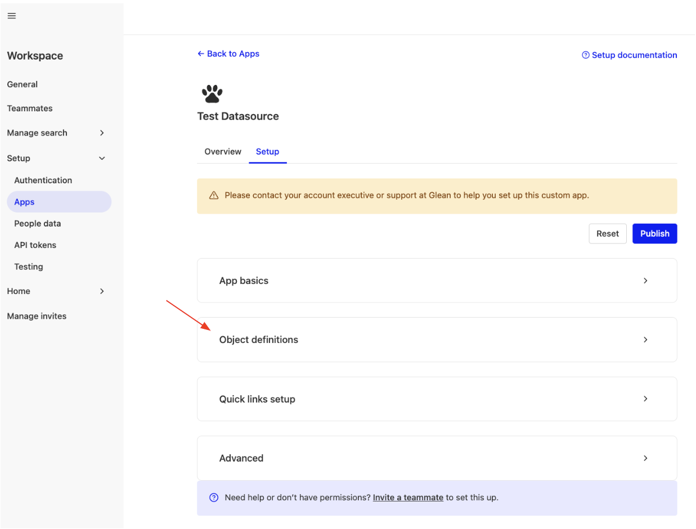
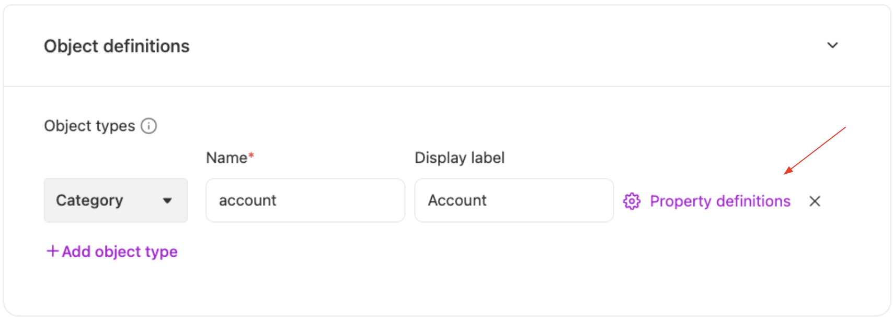
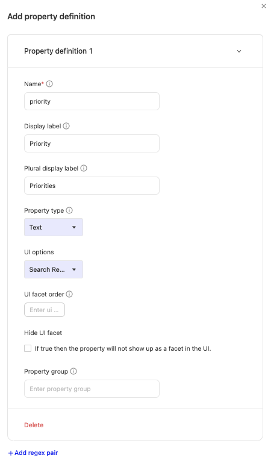
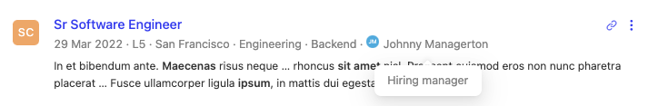

import Tabs from '@theme/Tabs';
import TabItem from '@theme/TabItem';


In this document, we discuss how to define custom properties for a datasource and how to upload them with each document.

:::tip
Custom Properties are tied to a custom datasource and require re-uploading the full document on every change. If you want to enrich documents from **any** datasource (including native connectors like Google Drive, Confluence, or Jira) without re-indexing, see the [Custom Metadata API](/api-info/indexing/custom-metadata/overview). For a side-by-side comparison, see [Custom Properties vs Custom Metadata](/api-info/indexing/custom-metadata/custom-properties-vs-custom-metadata).
:::

## What are custom properties?

Fundamentally, a custom property is any additional information that is attached to a document. These properties can be used in 3 different ways:

- [**Operators & Facets:**](#operators-and-facets) Ability to filter documents for your search
- [**Rendering:**](#rendering) Show useful information in the rendering of the search result
- [**Searchability and Ranking:**](#searchability-and-ranking) Make the document more searchable and serve as a ranking signal

The above 3 use-cases are explained in respective sections below. But first, we explain how you can set up and upload custom properties for your datasource.

:::info
  By default, no further action is needed after configuring and uploading custom
  properties to use them as facets/operators and to use them for improving
  searchability. Rendering requires a few additional steps (described below).
:::

## Setting up custom properties

:::warning
  It is highly recommended to configure custom properties first and then upload
  documents with the custom properties. Expect delays in indexing if it is done
  the other way round!
:::

Before custom properties can be uploaded for documents, we must configure the datasource to accept the specific custom properties. You need to define them under an object definition.

The configuration can be done in 2 ways:

1. [Admin console](https://app.glean.com/admin/setup/apps/) (_recommended_)
2. API calls to [`/adddatasource`](/api/indexing-api/add-or-update-datasource)

### Using admin console

**1. From the app setup page in the admin console, go to object definitions.**



**2. Define your object (if you haven't already) and click on property definitions.**

An object is any logical categorization of documents within your datasource (for example, documents/spreadsheets/slides can be objects for a drive datasource).



**3. Configure the properties in the property definition modal.**



### Using API Calls

Here is a sample API call for the above example:

<Tabs>
<TabItem value="curl" label="curl">

```bash snippet=custom-properties/snippet-01.sh
curl -X POST https://customer-be.glean.com/api/index/v1/adddatasource  \
-H 'Authorization : Bearer <token>' \
-H 'Content-Type : application/json' \
-d '
{
   "name": "testDatasource",
   "objectDefinitions": [
        {
            "name": "Account",
            "displayLabel": "Account",
            "propertyDefinitions": [
                {
                "name": "priority",
                "displayLabel": "Priority",
                "displayLabelPlural": "Priorities",
                "propertyType": "TEXT",
                "hideUiFacet": false
                }
            ]
        }
   ]
}'
```

</TabItem>
<TabItem value="python" label="Python">

```python snippet=custom-properties/snippet-02.py
from glean.api_client import Glean
import os

with Glean(
    api_token=os.getenv("GLEAN_INDEXING_API_TOKEN", ""),
    server_url=os.getenv("GLEAN_SERVER_URL", ""),
) as client:
    try:
        client.indexing.datasources.add(
            name="testDatasource",
            object_definitions=[
                {
                    "name": "Account",
                    "display_label": "Account",
                    "property_definitions": [
                        {
                            "name": "priority",
                            "display_label": "Priority",
                            "display_label_plural": "Priorities",
                            "property_type": "TEXT",
                            "hide_ui_facet": False,
                        }
                    ],
                }
            ],
        )
    except Exception as e:
        print(f"Exception when adding datasource: {e}")
```

</TabItem>
</Tabs>

The above API calls define a document type `Account` for our datasource `testDatasource`. For `Account` we define an operator called `priority`. This operator will become a facet if we set `hideUiFacet` to `false`.

Note: 
- propertyType `"INT"` is not faceted. 
- propertyType `"DATE"` is only faceted if specified value is an epoch timestamp in seconds.

## Uploading custom properties

After you have defined the properties, you can set the properties values while uploading the document. A sample API call for [`/indexdocument`](/api/indexing-api/index-document) where we illustrate how this is done is:
Here is a sample API call for the above example:

<Tabs>
<TabItem value="curl" label="curl">

```bash snippet=custom-properties/snippet-03.sh
curl -X POST https://customer-be.glean.com/api/index/v1/indexdocument \
-H 'Authorization : Bearer <token>' \
-H 'Content-Type : application/json' \
-d '
{
   "document": {
        "title": "Account 1",
        "id": "Account_1",
        "customProperties": [
            {
                "name": "priority",
                "value": "High"
            }
        ]
   }
}'
```

</TabItem>
<TabItem value="python" label="Python">

```python snippet=custom-properties/snippet-04.py
from glean.api_client import Glean, models
import os

with Glean(
    api_token=os.getenv("GLEAN_INDEXING_API_TOKEN", ""),
    server_url=os.getenv("GLEAN_SERVER_URL", ""),
) as client:
    try:
        # DocumentDefinition has many fields, we show the usage of a few basic ones.
        client.indexing.documents.add_or_update(
            document=models.DocumentDefinition(
                datasource="testDatasource",
                title="Account 1",
                id="Account_1",
                custom_properties=[
                    {"name": "priority", "value": "High"},
                ],
            )
        )
    except Exception as e:
        print(f"Exception when indexing document: {e}")
```

</TabItem>
</Tabs>

In the above API call we set the value for the custom property `Priority` as `High` for the document Account_1.

## Operators and Facets

### What are operators?

;vertical-align=top;')

Operators are a powerful way to filter information in Glean. In the above example we use the operators `app:` and `owner:` with query `Glean`. This tells Glean to only look for documents which match `“Glean”` and belong to `app:drive` and have `owner:”Steve Smith”`. This allows you to find the relevant information faster.

### What are Facets?

;vertical-align=top;')

Facets are special kinds of operators which are shown as visual filters in the Glean UI. You can find them on the right hand side of the search result page. This removes the burden of remembering the operators and gives you a nice and interactive way of filtering results.

:::info

Glean also has a default faceting behavior. Facets are automatically created of the same name for the following document fields if they are set for a document:

1. author
2. owner
3. tags
4. updatedAt
5. objectType

:::

### Example

Once you follow the steps above in defining custom properties and uploading them for a document, you should be able to use the `priority` operator and see it as a facet!

:::info

If you wish to hide the facet from showing up in the UI, you may select the 'Hide UI Facet' option in the admin console for the property (or) set `hideUiFacet` to true in the API call.

:::

## Rendering

Apart from the above mentioned steps for configuring and uploading custom properties, if you would like to show custom properties in the search result rendering - the following 2 steps are required:

1. In the `UI options` for the custom property, select Search Result (screenshot below) **(or)** set `uiOptions` for the custom property in the API call to `SEARCH_RESULT`.

;vertical-align=top;')

2. Contact Glean support to show the custom property to the search result as per your preference. An example is shown below.



**For more details on rendering of search result refer [here](/api-info/indexing/datasource/rendering-search-results/)**

:::warning

If you have already uploaded documents with a custom property, before setting the UI options for the property to include the Search result - please expect a delay (could be multiple hours, depending on the volume of documents) before the documents' properties are visible in the search results.

To propagate this update quicker - it is recommended to re-upload the documents (or) call the [`/processalldocuments`](/api/indexing-api/schedules-the-processing-of-uploaded-documents) endpoint for the datasource.

:::

## Searchability and Ranking

All custom properties are automatically used to enrich the document in the index - thereby improving searchability and ranking.

For example, if we have a ticketing datasource and include a ticket ID as a custom property - we can then search by the ticket ID to fetch the relevant ticket (without requiring it to be in the title or the body!).

### Special property: `country`

In addition to general ranking improvements, a custom property named `country` has special behavior.

:::info
If you set a custom property with `name: "country"`, its value is used as a ranking signal to personalize results based on the searcher's location.

- Acceptable values: ISO 3166-1 two-letter (alpha-2) or three-letter (alpha-3) country codes (for example, `US` or `USA`). Country names are also accepted, but ISO codes are preferred.
- Usage: add `{"name": "country", "value": "<ISO code or country name>"}` to a document's `customProperties`.
:::
