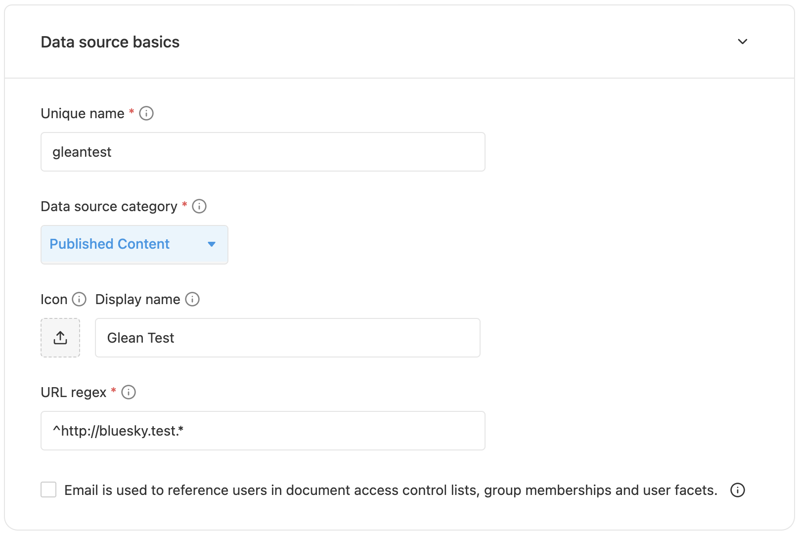

# Overview

The Glean Indexing API allows customers to put arbitrary content in the search index, making it available for Generative AI applications. This is particularly useful for performing permissions-aware searches over content in internal tools that reside on-premises, as well as for searching over applications that Glean does not currently support first class. Additionally, these APIs allow the customer to push organization data (people info, organization structure, etc.) into Glean.

In addition to documents, the Indexing API also supports indexing custom entities. These are structured key-value content, as opposed to being text heavy like documents. This feature is useful when the information is in the form of structured schema that can be represented as key-value type attributes.

Glean provides advance notice of any planned backwards incompatible changes along with a sunset period for anything that requires developers to adopt the new versions.

To get started with the Indexing API, you first need to create a datasource
that will store all the data you will be indexing.

# Setup Datasource

## Using the Glean Custom App Setup Page

<Info>
  Only Glean admins can set up custom apps using Glean's admin console. <br />
  If you are not a Glean admin, you can work with your Glean admin to set up a
  custom app or <br />
  follow Option 2 to set up a datasource using the `/adddatasource` API
  endpoint.
</Info>

To set up a custom app, admins can navigate to the admin console, then click on the [Data sources section](https://app.glean.com/admin/setup/apps).

Click on the "Add data source" button in the top right corner. In the modal that appears, click on "Custom" at the bottom of the list.

The key fields to quickly set up a datasource are listed under the "Data source basics" section. Some example values are shown in the screenshot below.



Once the values are set, click on the "Publish" button to create the custom app.

## Using the `/adddatasource` API Endpoint

When creating a datasource, the key fields you need to set are the following:
| Field | Description |
| --- | --- |
| `name` | A unique identifier used to refer to the datasource. |
| `displayName` | The datasource name shown in search results in the UI. |
| `datasourceCategory` | The type of this datasource. This affects how results are ranked. More details on how to select a category can be inferred from [Datasource Categories](../datasource/category) documentation. |
| `urlRegex` | A regex that captures the view URLs of documents in the datasource as accurately as possible. Avoid regexes that are too broad, and will capture URLs from other datasources, or regexes that are too narrow, and will not capture documents from this datasource. |
| `isUserReferencedByEmail` | This should be set to true if you want to refer to user identities using emails directly. If you have your own notion of user ids, this can be set to false. This affects how Glean interprets permissions attached to documents. |

<CodeGroup>

```bash cURL
curl -X POST https://customer-be.glean.com/api/index/v1/adddatasource \
  -H 'Authorization: Bearer <token>' \
  -d '
    {
      "name": "gleantest",
      "displayName": "Glean Test",
      "datasourceCategory": "PUBLISHED_CONTENT",
      "urlRegex": "^https://bluesky.test.*",
      "objectDefinitions": [
        {
          "name": "EngineeringDoc",
          "docCategory": "PUBLISHED_CONTENT"
        }
      ],
      "isUserReferencedByEmail": true
    }'
```

```python Python
from glean.api_client import Glean
import os

with Glean(
    api_token=os.getenv("GLEAN_INDEXING_API_TOKEN", ""),
    instance=os.getenv("GLEAN_INSTANCE", ""),
) as client:
    # Create a datasource
    try:
        client.indexing.datasources.add(request={
            "name": "gleantest",
            "displayName": "Glean Test",
            "datasourceCategory": "PUBLISHED_CONTENT",
            "urlRegex": "^http://bluesky.test.*",
            "objectDefinitions": [
                {
                    "name": "EngineeringDoc",
                    "docCategory": "PUBLISHED_CONTENT"
                }
            ],
            "isUserReferencedByEmail": True
        })
    except Exception as e:
        print(f"Exception when creating datasource: {e}")
```

</CodeGroup>

You can learn about more datasource customization options at
[here](https://developers.glean.com/indexing/tag/Datasources/paths/~1adddatasource/post/)

For more information about datasource categories, see [Datasource Categories](../datasource/category).
