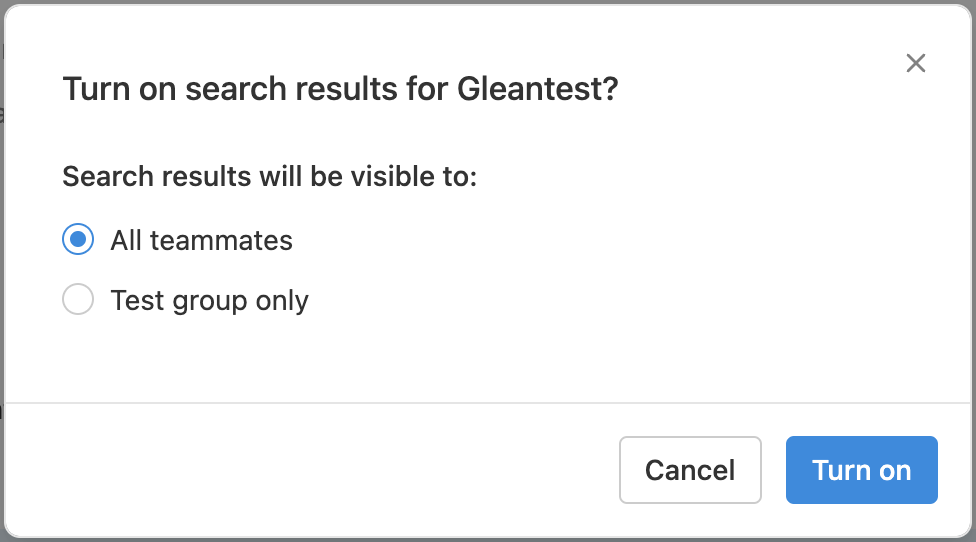

This guide will help you quickly get familiar with the basics of using the Indexing API by configuring a datasource, indexing a document, and enabling the datasource to show up in search.

## Index a document for the datasource

Once the datasource is configured, we can index documents. A document has the
following key fields.

`id`
This is a unique identifier for the document within the datasource. The id can
only contain alphanumeric characters (underscores are not allowed). The id
should be stable, meaning that the same document must keep the same id across
uploads. If an id is not provided, we use a hash of the `viewURL` as the id.

`objectType`
Type of object within the datasource. For example, a drive might have objects of
type file and folder.

`title`
Title of the document.

`body`
Searchable document body. This might be shown in search result snippets.

`viewURL`
A unique URL that can used to view the document in a browser. This viewURL must
also match the urlRegex specified while creating the datasource.

`permissions`
This can be used to control visibility of the document in search results for
different Glean users. For simplicity, in this tutorial, we will only index a
document with anonymous access using `permissions.allowAnonymousAccess`.

<CodeGroup>

```bash cURL
curl -X POST   https://customer-be.glean.com/api/index/v1/indexdocument \
  -H 'Authorization: Bearer <token>' \
  -H 'Content-Type : application/json' \
  -d '{
        "document": {
            "datasource": "gleantest",
            "objectType": "EngineeringDoc",
            "id": "blueskytest-1",
            "title": "Getting started with Blue Sky",
            "body": {
              "mimeType": "text/plain",
              "textContent": "This doc will help you get familiar with Blue Sky API"
            },
              "permissions": {
              "allowAnonymousAccess": true
            },
            "viewURL": "https://bluesky.test/blueskytest-1"
        }
    }'
```

```python Python
from glean.api_client import Glean
import os

with Glean(
    api_token=os.getenv("GLEAN_API_TOKEN", ""),
    instance=os.getenv("GLEAN_INSTANCE", ""),
) as client:
    # Index a document
    try:
        client.indexing.documents.index(request={
            "document": {
                "datasource": "gleantest",
                "objectType": "EngineeringDoc",
                "id": "blueskytest-1",
                "title": "This doc will help you get familiar with Blue Sky API",
                "viewURL": "https://bluesky.test/blueskytest-1",
                "body": {
                    "mimeType": "text/plain",
                    "textContent": "This doc will help you get familiar with Blue Sky API"
                },
                "permissions": {
                    "allowAnonymousAccess": True
                }
            }
        })
    except Exception as e:
        print(f"Exception when indexing document: {e}")
```

</CodeGroup>

To learn about more document customization options
[here](http://developers.glean.com/indexing/tag/Documents/paths/~1indexdocument/post/)

To learn more about how to set up user identities, and more complex permissions,
read [Setting
permissions](/indexing/documents/permissions)

To index documents in bulk, you can use [Bulk
indexing](/indexing/documents/bulk-indexing)

For helpful troubleshooting tips, read
[Troubleshooting](/indexing/debugging)

## Enable search results for the datasource

To be able to search for the indexed document in Glean, it must be enabled show up in search results.

Glean admins can go to the 'Overview' tab on the setup page for their custom app to enable the datasource to show up in search results.

Results can be configured to be visible to all teammates or to their configured test group

<Info>
  Document permissions are respected even when results are enabled for `All
  teammates` or `Test group only`. Enabling results for `All teammates` / `Test
  group only` does **not** mean configured permissions for documents will be
  overridden.
</Info>



## Success!

<Check>
  Once these steps are done, you should be able to search for the indexed
  document in Glean when logged in as the user added above. Note that it can
  take a few minutes for the document to reflect in the index after an
  /indexdocument call.
</Check>

## More examples

Take a look at our open-sourced repository for more code examples: [](https://github.com/gleanwork/indexing-api-connectors/)

Refer to the [Wikipedia](https://github.com/gleanwork/indexing-api-connectors/tree/main/wikipedia) toy example which indexes some relevant articles from Wikipedia using the Indexing API.

<Note>
  Help us improve by contributing to the open-sourced repository by suggesting
  more examples and creating issues with feedback!
</Note>
