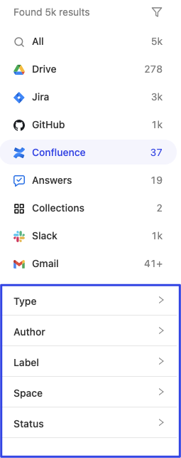

Besides the [general filters](/guides/search/filtering-results), some filters are specific to one datasource. For example, Confluence has the `author` facet, and Slack has the `channel` facet. Custom datasources pushed through the Indexing API can also define their own facets.

:::tip Using the Platform API?
Platform Search discovers filters with [List search filters](/api/platform-api/platform-search-filters) instead of `facetResults`. For a runnable example, see the [Search with discovered filters](/cookbook/search-with-discovered-filters) recipe.
:::

To uncover these datasource-specific facets, you can use our Glean UI to filter by the datasource you’re curious about. You will be able to find a list of facets for your search results, and facet values on the sidebar of the Glean UI (see image below).



### Getting possible facets via Search API

To get the same facets and values that populate the Glean UI sidebar, send a [search](/api/client-api/search/search) request like this:

```json snippet=datasource-filters/snippet-01.json
{
  "query": "test",
  "pageSize": 10,
  "requestOptions": {
    "facetBucketSize": 3000,
    "facetFilters": [
      {
        "fieldName": "app",
        "values": [
          {
            "value": "confluence",
            "relationType": "EQUALS"
          }
        ]
      }
    ]
  }
}
```

This will return a top-level field, [`facetResults`](/api/client-api/search/search#responses). 
facetResults has the following relevant fields:

1. [`sourceName`](/api/client-api/search/search#responses) - same as the facet `fieldName` in the `facetFilter`s object
2. [`operatorName`](/api/client-api/search/search#responses) - a display hint, `SelectSingle` or `SelectMultiple`
3. [`buckets`](/api/client-api/search/search#responses) - a list of facet bucket objects corresponding to a facet value
   1. The facet bucket object has the following relevant fields:
      1. [`count`](/api/client-api/search/search#responses) - the number of search results that would be returned if filtering by the facet value
      2. [`value`](/api/client-api/search/search#responses) - the facet value (ie “engineering” for the space facet)
         1. [`stringValue`](/api/client-api/search/search#responses) - the string value
         2. [`integerValue`](/api/client-api/search/search#responses) - the integer value (not common)
         3. [`displayLabel`](/api/client-api/search/search#responses) - alternative value used for display in the UI
         4. [`iconConfig`](/api/client-api/search/search#responses) - optional image used to represent the facet value, such as a profile picture for people facet values.

```json snippet=datasource-filters/snippet-02.json
{
  "sourceName": "space",
  "operatorName": "SelectMultiple",
  "buckets": [
    {
      "count": 3,
      "value": {
        "stringValue": "engineering"
      }
    }
  ]
}
```

The `sourceName` values in `facetResults` are the facets you can use with that datasource. Pass a bucket's `stringValue` unchanged as the filter value.

If latency is a concern, and you only want to receive `facetResults`, you can send a request with [`pageSize`](/api/client-api/search/search#request) = 0, and add "FACET_RESULTS" within the [`responseHints`](/api/client-api/search/search#request) field in [`requestOptions`](/api/client-api/search/search#request) to not retrieve any documents and only retrieve facetResults. See sample request body below, which would gather `facetResults` for all confluence specific facets:

```json snippet=datasource-filters/snippet-03.json
{
  "query": "test",
  "pageSize": 0,
  "requestOptions": {
    "facetBucketSize": 3000,
    "facetFilters": [
      {
        "fieldName": "app",
        "values": [
          {
            "value": "confluence",
            "relationType": "EQUALS"
          }
        ]
      }
    ],
    "responseHints": ["FACET_RESULTS"]
  }
}
```
