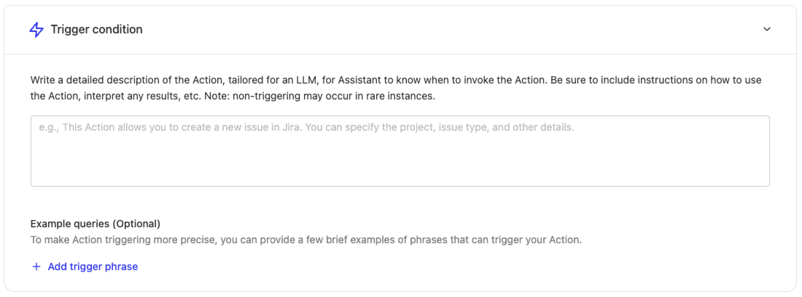
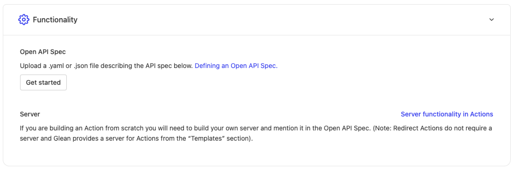

# Creating Tools

## Overview

Tools allow you to create automated workflows and integrations within Glean. This guide walks through the process of creating and configuring a Tool.

:::note
You must have an `Admin` or `Tool creator` role to create tools.
:::

To get started, navigate to [Admin console > Platform > Tools](https://app.glean.com/admin/platform/tools) where you'll see a list of all available tools. Click the "Add" button to begin.

You can choose to create a custom tool from scratch, build a simple redirect tool or pick from one of the available out-of-the-box tools (if enabled for you).

:::tip
For common applications like Jira and Salesforce, Glean offers first-party, out-of-the-box tools that require no coding — select one of the available out-of-the-box tools (if enabled for you) instead of building from scratch. For other use cases, create a custom tool from scratch.
:::

If you select creating a tool from scratch, these are the steps to create a tool:

<Steps titleSize="h3">
  <Step title="Basic Information">
    Start by providing the essential details to identify your tool:

    | Field | Type | Required | Description |
    |-------|------|----------|-------------|
    | **Display name** | string | ✓ | The name that will be shown on the Tools page |
    | **Display description** | string | ✓ | A clear description of what your tool does |
    | **Unique identifier** | string | ✓ | A unique identifier to distinguish your tool from others with similar names |
    | **Tool type** | string | ✓ | Choose between: **Write** (performs operations in external apps) or **Read (retrieval)** (fetches information from external applications) |

    #### Tool Types in Detail

    <CardGroup cols={2}>
      <Card title="Write" icon="Zap">
        Helps users perform operations in external apps. Can be either:
        - **Execution**: Runs inside Glean — Glean calls the external API directly
        - **Redirect**: Sends users to the appropriate external URL
      </Card>
      <Card title="Read (retrieval)" icon="Download">
        Fetches information from external applications that may or may not be indexed with Glean
      </Card>
    </CardGroup>
  </Step>

  <Step title="Trigger Condition">
    Configure when your tool should be triggered in Glean Chat.

    

    :::info
    When users interact with Glean Chat, the system matches their requests against the trigger conditions to determine which tool to use.
    :::

    For example, for an IT support Tool, you might include trigger conditions like:

    "Creates IT support tickets on JIRA. Use this tool when the user wants to create a support ticket, needs access to something or wants help with any IT related issues."

    You can also provide example queries such as:
    - "I forgot my password for Notion"
    - "Need to reset my password for gmail"
    - "I need access to gong"
  </Step>

  <Step title="Functionality">
    Define the specific configurations for your tool.

    For tools created from scratch, you'll need to upload an API spec:

    
  </Step>

  <Step title="Authentication">
    :::note
    This step is only required for tools with a server.
    :::

    Configure how Glean should pass authentication information for requests coming from Glean to your tool's server.
  </Step>
</Steps>

## Testing and Deployment

### Testing Your Tool

After saving your tool, use the testing link provided at the bottom of the page to verify its functionality. Test with various queries that should trigger the tool and refine the Trigger Condition if needed.

### Deployment Options

Tools can be enabled on the following surfaces, each controlled by an independent toggle:

<CardGroup cols={3}>
  <Card title="Chat" icon="MessageCircle">
    Let users invoke the tool conversationally in Glean Assistant. This toggle only appears for tools validated for conversational, single-turn use.
  </Card>
  <Card title="Agents" icon="agent" iconSet="glean">
    Make the tool available as a step when building or running Glean Agents.
  </Card>
  <Card title="Glean MCP Server" icon="Server">
    Make the tool available through the Glean MCP server for all or some teammates.
  </Card>
</CardGroup>

## API Specification Configuration

:::note
This section only applies to custom tools built from scratch.
:::

When configuring the API spec for your tool, provide a YAML or JSON file that follows these requirements:

- Contains a single endpoint defined in /paths (e.g., /execute)
- Fields should be added in either requestBody.content or parameters
- All fields must follow this format:
  - No nested fields (only string/number/integer/boolean or arrays of these types)
  - Use enum with a single value for fixed values
  - Assistant can guess non-fixed values
  - Mark required fields using standard OpenAPI specifications

For example implementations and API specs, refer to our [examples documentation](/guides/tools/examples/jira-issue-creation). 
