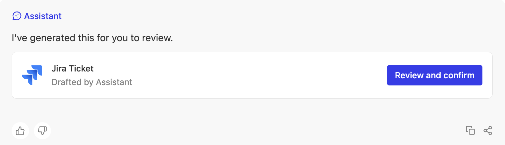

# Tools Overview

:::info
Tools were formerly called **Actions** — older material and URLs may still use that name.
:::

Tools can supercharge your Glean Chat and help automate a lot of your work!

Out of the box, Glean Chat can answer user's queries by finding and retrieving the right information from the hundreds of documents indexed with Glean. On top of this, using tools, companies can now enable Glean Chat to also perform actions on behalf of the user or answer questions based on company information not indexed with Glean.

Using tools you can:

1. Make Glean Chat take action by simply chatting with it, e.g. user can ask Glean Chat to create a jira ticket for a certain feature, and it will do so with the right information pre-filled.

2. Give Glean Chat the ability to retrieve information from specific data sources that may or may not already be indexed with glean, e.g. a company database

## How does it work?

Tools can be created by anyone with an `Admin` or `Tool creator` role. Once the tool is created, the creator can deploy the tool to Glean Chat or make it available to Glean Agents.

Once the tool is deployed to Glean Chat:
Whenever users chat with Glean Chat, the system will go through the list of available tools and figure out if any of them should be used to resolve this user's query. For example, if a user messages to Glean Chat - "I need access to Salesforce" - the Glean Chat system will go through a list of tools and find a tool that best matches this user's query and then perform the operation defined in that tool. In this case, it would find a support ticket creation tool, using which it would create a request for salesforce access with this user's information automatically filled in.

For user query: "I need access to Salesforce", chat automatically creates a support ticket with the right assignee and information, and responds to user like this:

Users can review the pre-filled information and confirm, after which the ticket will be created.

How are these operations performed in an external application once the user confirms?
The tool performs them by making requests to the APIs defined while creating the tool.
Note: Glean respects the supported authorization while making these requests.

Alternatively, instead of deploying to Glean Chat, the tool can be made available to agent creators, who can add it to their agents in the agent builder. Then, for any user chatting with that agent, the agent will use the tool in a similar way as described for Glean Chat above.

## Next Steps

<CardGroup cols={2}>
  <Card 
    title="Authentication"
    icon="Shield"
    href="/guides/tools/authentication"
  >
    Learn how to configure authentication for your tools
  </Card>
  
  <Card 
    title="Create Tools"
    icon="Plus"
    href="/guides/tools/create-tools"
  >
    Step-by-step guide to creating your first tool
  </Card>
  
  <Card 
    title="Examples"
    icon="Code"
    href="/guides/tools/examples/jira-issue-creation"
  >
    See working examples of tools in practice
  </Card>
  
  <Card 
    title="FAQ"
    icon="HelpCircle"
    href="/guides/tools/faq"
  >
    Common questions and troubleshooting
  </Card>
</CardGroup> 
