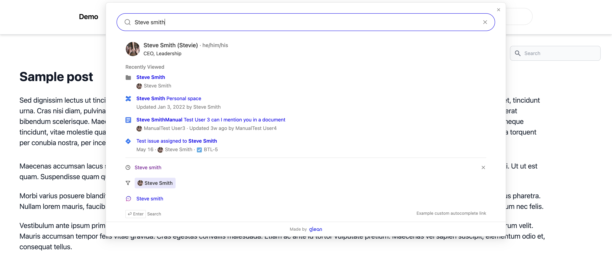
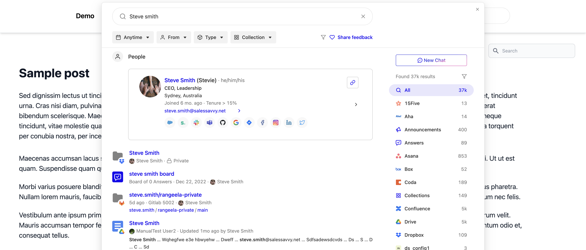

import Tabs from '@theme/Tabs';
import TabItem from '@theme/TabItem';

Glean's Modal Search provides a seamless search experience by overlaying a search interface on your existing page. This solution requires minimal implementation effort - just a single line of code to get started.

<Frame></Frame>

<Frame></Frame>

## Implementation Guide

### Adding the JavaScript Client

Include the JavaScript library in your page's `<head>` section. Replace `GLEAN_APP_DOMAIN` with your company's Glean web app domain (typically `app.glean.com` or `your-company.glean.com` for custom subdomains).

:::info
The Glean web app domain differs from your company's Glean backend domain
(which typically follows the format `your-company-be.glean.com`).
:::

<Tabs>
<TabItem value="html" label="HTML">

```html
<script
  defer
  src="https://{GLEAN_APP_DOMAIN}/embedded-search-latest.min.js"
></script>
```

</TabItem>
</Tabs>

### Basic Setup

To implement Modal Search, use the [attach](https://app.glean.com/meta/browser_api/interfaces/GleanWebSDK.html#attach) method to connect the Glean SDK to a search input element on your page:

<Tabs>
<TabItem value="implementation" label="Implementation">

```html
<script>
  addEventListener('DOMContentLoaded', () =>{' '}
  {GleanWebSDK.attach(document.getElementById('search-box'))})
</script>
```

</TabItem>
</Tabs>

## Customization Options

### Component API

The Modal Search implementation can be customized using the [GleanWebSDK.attach](https://app.glean.com/meta/browser_api/interfaces/GleanWebSDK.html#attach) API. This interface provides options for tailoring the search experience to your specific needs.

### Theming

You can customize the appearance of the Modal Search using [SearchBoxCustomizations](https://app.glean.com/meta/browser_api/interfaces/SearchBoxCustomizations.html). The theming system is regularly expanded with additional options based on customer needs.

## Implementation Example

Explore a complete working implementation of the Modal Search component in our interactive demo:

<Frame>
  <iframe
    src="https://codepen.io/GleanWork/embed/VwWJOjZ?default-tab=js%2Cresult&editable=true"
    style={{ width: '100%', height: '500px' }}
    title="Modal Search | Glean"
  />
</Frame>
