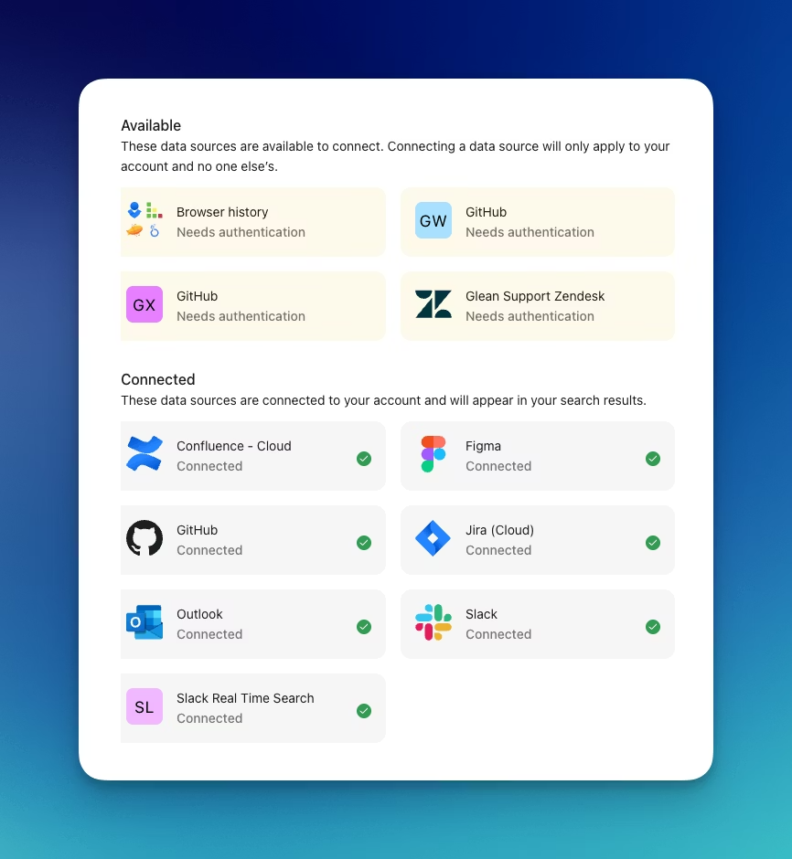

import Tabs from '@theme/Tabs';
import TabItem from '@theme/TabItem';

Integrate Glean settings into your internal app to allow users to connect certain datasources that require seperate authentication (for example, Slack RTS, GitHub) so Glean can access their private data on their behalf.

<Frame>
  
</Frame>

:::warning
It is possible for browser security features to prevent the OAuth popup from informing the SDK that a user has successfully authenticated. For the highest reliability, use the Glean web app or the [`checkdatasourceauth`](/api/client-api/authentication/checkdatasourceauth) API
:::

## Implementation Guide

### Adding the JavaScript Client

First, include the JavaScript library in the `<head>` section of your page. Replace `GLEAN_APP_DOMAIN` with your company's Glean web app domain (typically `app.glean.com` or `your-company.glean.com` if you use a custom subdomain).

:::info
  The Glean web app domain differs from your company's Glean backend domain
  (find yours at [app.glean.com/admin/about-glean](https://app.glean.com/admin/about-glean) under "Server instance (QE)").
:::

<Tabs>
<TabItem value="html" label="HTML">

```html
<script
    defer
    src="https://{GLEAN_APP_DOMAIN}/embedded-search-latest.min.js"
  ></script>
```

</TabItem>
</Tabs>

### Configuration and Setup

1. Create a container element with the following required CSS properties:

   - `position: relative`
   - `display: block`
   - Appropriate sizing and positioning

2. Render Settings into your container:

<Tabs>
<TabItem value="javascript" label="JavaScript">

```javascript
window.GleanWebSDK.renderSettings(containerElement, { /** Options */ });
```

</TabItem>
</Tabs>

For detailed configuration options and customizations, refer to our [renderSettings API documentation](https://app.glean.com/meta/browser_api/interfaces/GleanWebSDK.html#renderSettings).
