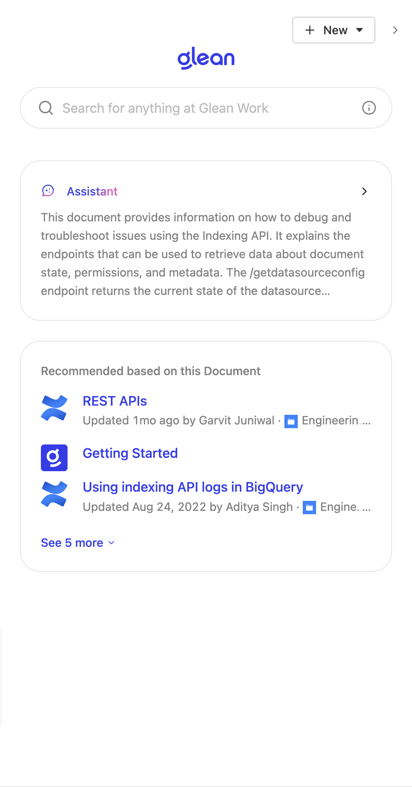

import Tabs from '@theme/Tabs';
import TabItem from '@theme/TabItem';

The Glean Sidebar provides a unified interface that combines search capabilities, chat functionality, and contextual recommendations, all accessible from a slide-out panel on your page.

<Frame>
  <div className="grid grid-cols-2 gap-3">
     
  </div>
</Frame>

## Implementation Guide

### Adding the JavaScript Client

Include the JavaScript library in your page's `<head>` section. Replace `GLEAN_APP_DOMAIN` with your company's Glean web app domain (typically `app.glean.com` or `your-company.glean.com` for custom subdomains).

:::info
The Glean web app domain differs from your company's Glean backend domain
(which typically follows the format `your-company-be.glean.com`).
:::

<Tabs>
<TabItem value="html" label="HTML">

```html
<script
  defer
  src="https://{GLEAN_APP_DOMAIN}/embedded-search-latest.min.js"
></script>
```

</TabItem>
</Tabs>

### Basic Setup

Implementing the Sidebar requires a single method call to [openSidebar](https://app.glean.com/meta/browser_api/interfaces/GleanWebSDK.html#openSidebar). You can trigger this method in response to user actions, such as clicking a button:

<Tabs>
<TabItem value="javascript" label="JavaScript">

```javascript
GleanWebSDK.openSidebar();
```

</TabItem>
</Tabs>

## Customization Options

The Sidebar component can be customized using the [GleanWebSDK.openSidebar](https://app.glean.com/meta/browser_api/interfaces/GleanWebSDK.html#openSidebar) API. This interface provides options for tailoring the sidebar experience to match your application's needs.

## Implementation Example

Experience a complete working implementation of the Sidebar component in our interactive demo:

<Frame>
  <iframe
    src="https://codepen.io/GleanWork/embed/VwWJOjZ?default-tab=js%2Cresult&editable=true"
    style={{ width: '100%', height: '500px' }}
    title="Sidebar | Glean"
  />
</Frame>
