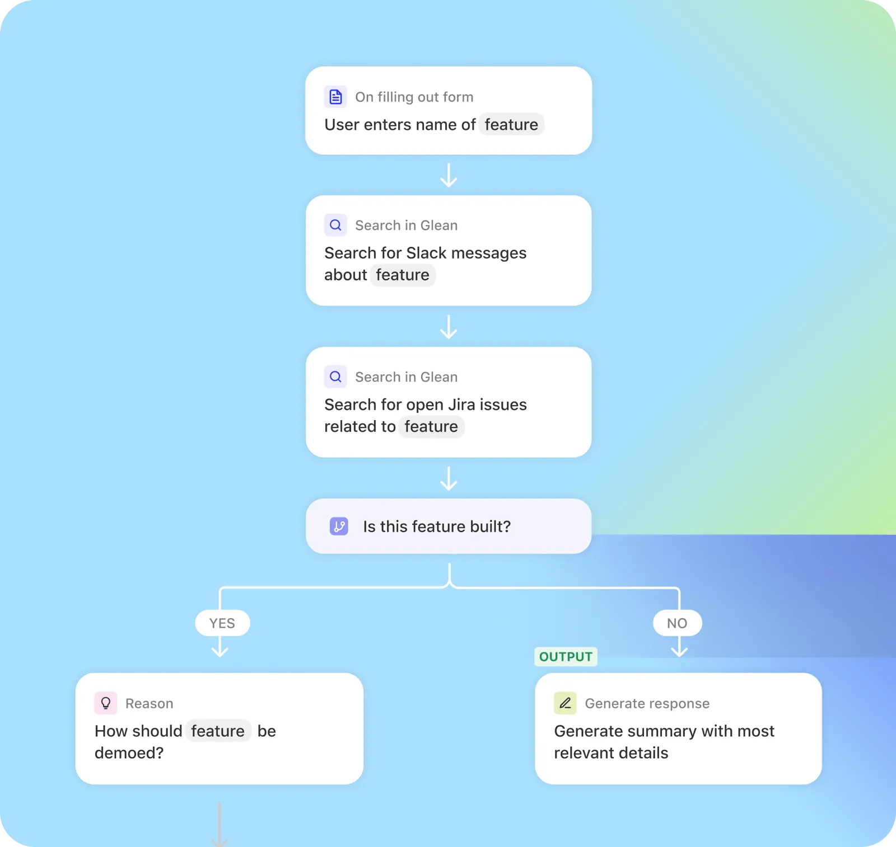
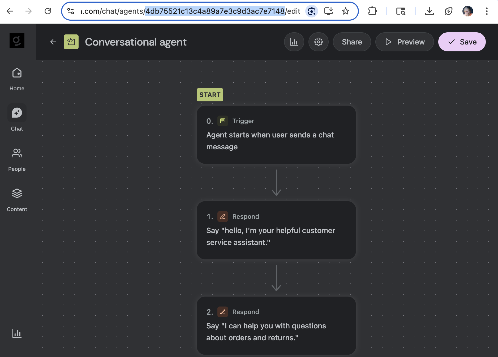

# Agents API

Glean agents enable you to build, deploy, and manage AI agents across your organization. The Agents API provides programmatic control over these agents.

<Card title="Go to Agents API Reference" href="https://app.glean.com" icon="agents">
</Card>

### Use Cases

The Agents API enables:

- Integrating Glean agents with external applications
- Retrieving agent responses for your applications
- Streaming agent responses to chat interfaces
- Discovering available agents in your deployment
- Monitoring agent changes by examining input and output schemas

### Agent Builder

Users in your organization can create and configure agents through Glean's no-code/low-code Agent Builder interface.


### Considerations

- The Agents API implements a subset of the [LangChain Agent Protocol](https://langchain-ai.github.io/agent-protocol/api.html#tag/agents), specifically [Runs](https://langchain-ai.github.io/agent-protocol/api.html#tag/runs) and [Agents](https://langchain-ai.github.io/agent-protocol/api.html#tag/agents), ensuring compatibility with any agent runtime that supports this standard.
- You can look up an agent ID by examining the Agent Builder URL.
  


import { LangChainIcon } from './snippets/agents/icons.mdx';

# <LangChainIcon className="inline" height="2rem" /> Glean LangChain Integration

Glean's official LangChain integration enables you to build powerful AI agents that can search and reason over your organization's knowledge using Python and the LangChain framework.

<Card
  title="langchain-glean"
  icon="github"
  href="https://github.com/gleanwork/langchain-glean"
>
  Official LangChain integration for Glean's search and chat capabilities
</Card>

### Installation

<Tabs>
  <Tab title="pip">```bash pip install -U langchain-glean ```</Tab>
  <Tab title="poetry">```bash poetry add langchain-glean ```</Tab>
  <Tab title="uv">```bash uv add langchain-glean ```</Tab>
</Tabs>

### Configuration

#### API Tokens

You'll need Glean [API credentials](/client/authentication#glean-issued-tokens), and specifically a [user-scoped API token](client/authentication#user). API Tokens require the following scopes: `chat`, `search`. You should speak to your Glean administrator to provision these tokens.

#### Configure Environment Variables

Configure your Glean credentials by setting the following environment variables:

```bash
export GLEAN_SUBDOMAIN="your-glean-subdomain"
export GLEAN_API_TOKEN="your-glean-api-token"
export GLEAN_ACT_AS="user@example.com"  # Optional: Email to act as when making requests
```

### Usage Examples

#### Using the Retriever

The `GleanSearchRetriever` allows you to search and retrieve documents from Glean:

```python
from langchain_glean.retrievers import GleanSearchRetriever

# Initialize the retriever (will use environment variables)
retriever = GleanSearchRetriever()

# Search for documents
documents = retriever.invoke("quarterly sales report")

# Process the results
for doc in documents:
    print(f"Title: {doc.metadata.get('title')}")
    print(f"URL: {doc.metadata.get('url')}")
    print(f"Content: {doc.page_content}")
    print("---")
```

#### Building an Agent with Tools

The `GleanSearchTool` can be used in LangChain agents to search Glean:

```python
from langchain_core.prompts import ChatPromptTemplate
from langchain_openai import ChatOpenAI
from langchain.agents import AgentExecutor, create_openai_tools_agent
from langchain_glean.retrievers import GleanSearchRetriever
from langchain_glean.tools import GleanSearchTool

# Initialize the retriever
retriever = GleanSearchRetriever()

# Create the tool
glean_tool = GleanSearchTool(
    retriever=retriever,
    name="glean_search",
    description="Search for information in your organization's content using Glean."
)

# Create an agent with the tool
llm = ChatOpenAI(model="gpt-4o")
prompt = ChatPromptTemplate.from_messages([
    ("system", "You are a helpful assistant with access to Glean search."),
    ("user", "{input}")
])

agent = create_openai_tools_agent(llm, [glean_tool], prompt)
agent_executor = AgentExecutor(agent=agent, tools=[glean_tool])

# Run the agent
response = agent_executor.invoke({"input": "Find the latest quarterly report"})
print(response["output"])
```

#### RAG with LangChain Chains

You can integrate the retriever with LangChain chains for more complex workflows:

```python
from langchain_core.output_parsers import StrOutputParser
from langchain_core.prompts import ChatPromptTemplate
from langchain_core.runnables import RunnablePassthrough
from langchain_openai import ChatOpenAI
from langchain_glean.retrievers import GleanSearchRetriever

# Initialize the retriever
retriever = GleanSearchRetriever()

# Create a prompt template
prompt = ChatPromptTemplate.from_template(
    """Answer the question based only on the context provided.

Context: {context}

Question: {question}"""
)

# Initialize the language model
llm = ChatOpenAI(model="gpt-4o")

# Format documents function
def format_docs(docs):
    return "\n\n".join(doc.page_content for doc in docs)

# Create the chain
chain = (
    {"context": retriever | format_docs, "question": RunnablePassthrough()}
    | prompt
    | llm
    | StrOutputParser()
)

# Run the chain
result = chain.invoke("What were our Q2 sales results?")
print(result)
```

### Advanced Usage

#### Search Parameters

You can customize your search by passing additional parameters:

```python
# Search with additional parameters
documents = retriever.invoke(
    "quarterly sales report",
    page_size=5,  # Number of results to return
    disable_spellcheck=True,  # Disable spellcheck
    max_snippet_size=200  # Maximum snippet size
)
```

#### Custom Retriever Configuration

Configure the retriever with custom settings:

```python
# Initialize with custom settings
retriever = GleanSearchRetriever(
    subdomain="your-subdomain",  # Override environment variable
    api_token="your-api-token",  # Override environment variable
    act_as="user@example.com",   # Override environment variable
    page_size=10,               # Default number of results
    max_snippet_size=300        # Default snippet size
)
```

For the complete API documentation and implementation details, visit the [GitHub repository](https://github.com/gleanwork/langchain-glean).
